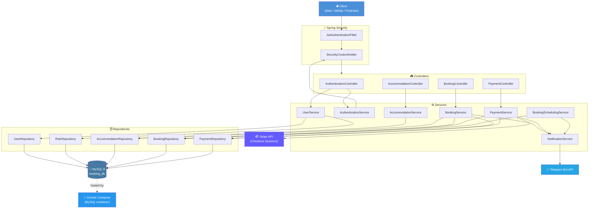
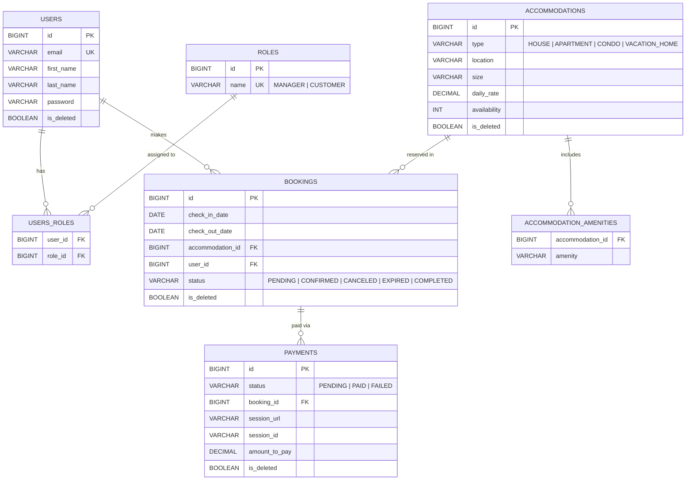

<div align="center">
# 🏨 Booking App — Accommodation Booking Platform

### A production-grade Spring Boot REST API for booking accommodations, processing payments via Stripe, and notifying staff in real time through Telegram.

[](https://openjdk.org/projects/jdk/17/)
[](https://spring.io/projects/spring-boot)
[](https://www.mysql.com/)
[](https://www.docker.com/)
[](https://www.liquibase.org/)
[](https://jwt.io/)
[](https://stripe.com/)
[](https://core.telegram.org/bots)
[](https://github.com/features/actions)
[](https://swagger.io/)

</div>
---

## 📑 Table of Contents

- [About the Project](#-about-the-project)
- [Technologies & Tools](#-technologies--tools)
- [Architecture](#-architecture)
- [Domain Model](#-domain-model)
- [Features](#-features)
- [API Reference](#-api-reference)
- [Security](#-security)
- [Stripe Integration](#-stripe-integration)
- [Telegram Bot](#-telegram-bot)
- [Scheduled Tasks](#-scheduled-tasks)
- [Docker](#-docker)
- [Local Setup](#-local-setup)
- [Environment Variables](#-environment-variables)
- [Swagger](#-swagger)
- [Testing](#-testing)
- [Code Quality](#-code-quality)
- [Project Structure](#-project-structure)
- [Future Improvements](#-future-improvements)
- [Author](#-author)
---

## 📖 About the Project

**Booking App** is a backend service for an accommodation‑booking platform, comparable in spirit to a simplified Airbnb/Booking.com core engine. It lets **customers** browse accommodations and reserve stays, while **managers** control inventory and oversee reservations — with real payment processing through **Stripe** and instant **Telegram** notifications on every booking lifecycle event.

**What problem it solves**
Small hospitality operators and property managers need a lightweight, self‑hosted system to manage listings, prevent double‑bookings, collect payments, and stay informed — without paying for a heavyweight SaaS platform or building booking logic from scratch.

**Why it exists**
The project demonstrates how a real‑world Spring Boot service is composed end‑to‑end: authentication and authorization, transactional business rules (overlap detection, pending‑payment locks), external payment processing, asynchronous notifications, and scheduled background jobs — all wired together with clean layering and proper database versioning.

**Who it is for**
- Developers looking for a reference implementation of a secured, layered Spring Boot REST API.
- Small businesses that need a self‑hosted booking + payment backend.
- Engineers evaluating a Stripe Checkout + Telegram Bot integration pattern in Java.
  **Architecture philosophy**
  The codebase follows a strict **layered architecture** — `Controller → Service → Repository → Database` — with **DTOs** isolating the persistence model from the API contract, **MapStruct** eliminating manual mapping boilerplate, **Liquibase** version‑controlling every schema change, and a **global exception handler** centralizing error responses. Soft deletion (`is_deleted` + Hibernate `@SQLDelete`/`@SQLRestriction`) is used across all core entities instead of hard deletes, preserving historical/financial data integrity.

---

## 🛠 Technologies & Tools

| Category | Technology |
|---|---|
| **Language** | Java 17 |
| **Framework** | Spring Boot 3.2.5 |
| **Web** | Spring Web (Spring MVC, REST) |
| **Data Access** | Spring Data JPA / Hibernate |
| **Database** | MySQL 8.0.33 (runtime), H2 (tests) |
| **Migrations** | Liquibase |
| **Security** | Spring Security 6, JWT (`jjwt` 0.12.5), BCrypt |
| **Payments** | Stripe Java SDK 24.22.0 (Checkout Sessions) |
| **Notifications** | Telegram Bots API (`telegrambots-spring-boot-starter` 6.8.0) |
| **Object Mapping** | MapStruct 1.5.5 |
| **Validation** | Jakarta Bean Validation (`spring-boot-starter-validation`) |
| **API Documentation** | springdoc-openapi (Swagger UI) 2.5.0 |
| **Boilerplate Reduction** | Lombok |
| **Config Management** | `spring-dotenv` (`.env` file loading) |
| **Testing** | JUnit 5, Mockito, Spring Security Test, `@DataJpaTest`, MockMvc, H2 |
| **Build Tool** | Maven (with wrapper) |
| **Code Style** | Checkstyle (Google Java Style based) |
| **CI/CD** | GitHub Actions |
| **Containerization** | Docker Compose (MySQL) |
 
---

## 🏗 Architecture

The API follows a classic **layered (N‑tier) architecture**. Every inbound request passes through the security filter chain before reaching a controller, and business rules live exclusively in the service layer.


 
---

## 🧬 Domain Model

Every entity below is mapped from the actual JPA models and Liquibase changesets. Core tables (`accommodations`, `bookings`, `users`, `payments`) implement **soft delete** via an `is_deleted` flag combined with Hibernate `@SQLDelete` / `@SQLRestriction`.



**Relationship notes**

| Relationship | Type | Enforced by |
|---|---|---|
| `User` ↔ `Role` | Many‑to‑Many | `users_roles` join table |
| `User` → `Booking` | One‑to‑Many | `bookings.user_id` FK, `@ManyToOne(LAZY)` on `Booking` |
| `Accommodation` → `Booking` | One‑to‑Many | `bookings.accommodation_id` FK |
| `Accommodation` → amenities | One‑to‑Many (`@ElementCollection`) | `accommodation_amenities` table |
| `Booking` → `Payment` | One‑to‑Many | `payments.booking_id` FK |
 
---

## ✨ Features

<details open>
<summary><strong>🔑 Authentication</strong></summary>
- User registration (`POST /auth/registration`) with duplicate‑email protection (`RegistrationException` → `409 CONFLICT`).
- Every new registrant is automatically assigned the **`CUSTOMER`** role.
- Login (`POST /auth/login`) authenticates against Spring's `AuthenticationManager` and returns a signed JWT.
- Passwords are hashed with **BCrypt** before persistence.
</details>
<details>
<summary><strong>🏠 Accommodation Management</strong></summary>
- Full CRUD for accommodations (`HOUSE`, `APARTMENT`, `CONDO`, `VACATION_HOME`).
- Amenities stored as an `@ElementCollection` (`accommodation_amenities` table).
- Paginated listing (`Pageable`) and single‑resource lookup.
- Create / update / delete restricted to `MANAGER` role; read endpoints are open to authenticated users.
</details>
<details>
<summary><strong>📅 Booking Management</strong></summary>
- Date‑range overlap detection via a custom JPQL query (`countOverlappingBookings`) that blocks bookings once availability is exhausted.
- Prevents booking creation if the requesting user already has a **pending payment** on another booking.
- Validates that check‑in is today‑or‑future and check‑out is strictly after check‑in.
- Customers see only their own bookings; managers can filter by `userId` and `status`.
- Cancelling a booking transitions its status to `CANCELED` instead of a hard delete, and triggers a Telegram notification.
</details>
<details>
<summary><strong>💳 Payment Processing</strong></summary>
- Creates a Stripe **Checkout Session** priced from `accommodation.dailyRate × nights`.
- Persists `sessionId`, `sessionUrl`, and computed `amountToPay` for every payment attempt.
- Dedicated success/cancel callback endpoints update `Payment` and `Booking` status accordingly.
- Managers can view all payments or filter by user; customers see only their own.
</details>
<details>
<summary><strong>📲 Telegram Notifications</strong></summary>
- Real‑time alerts for booking creation, successful payment, booking cancellation, and expired bookings.
- Delivered through a dedicated `BookingTelegramBot` (long‑polling bot).
</details>
<details>
<summary><strong>⏰ Scheduled Jobs</strong></summary>
- Daily cron job (`0 0 12 * * ?`) scans for bookings whose `checkOutDate` has passed while still `PENDING`/`CONFIRMED`, marks them `EXPIRED`, and notifies Telegram — including a "no expired bookings today" message when the run is clean.
</details>
<details>
<summary><strong>🛡 Security</strong></summary>
- Stateless JWT authentication with a custom `OncePerRequestFilter`.
- Method‑level authorization via `@PreAuthorize` (`hasAuthority`, `hasAnyAuthority`).
- Public endpoints limited to `/auth/**`, `/error`, `/swagger-ui/**`, `/v3/api-docs/**` — everything else requires a valid token.
</details>
<details>
<summary><strong>✅ Validation</strong></summary>
- Jakarta Bean Validation annotations (`@NotNull`, `@NotBlank`, `@NotEmpty`, `@Email`, `@Length`, `@Future`, `@FutureOrPresent`, `@DecimalMin`, `@Min`) enforced on every request DTO.
- Validation failures are collected and returned as a structured list of field‑level error messages.
</details>
<details>
<summary><strong>⚠️ Error Handling</strong></summary>
- Centralized `@RestControllerAdvice` (`GlobalExceptionHandler`) maps domain exceptions to precise HTTP statuses:
  - `EntityNotFoundException` → `404 NOT_FOUND`
  - `RegistrationException` → `409 CONFLICT`
  - `TelegramException` → `409 CONFLICT`
  - `AccessDeniedException` → `403 FORBIDDEN`
  - `MethodArgumentNotValidException` → `400 BAD_REQUEST` (field‑level messages)
  - Any uncaught exception → `500 INTERNAL_SERVER_ERROR`
</details>
<details>
<summary><strong>🐳 Docker Support</strong></summary>
- `docker-compose.yml` spins up a MySQL 8.0.33 container (`booking_db`) with a named volume for persistent storage, exposed on host port `3307`.
</details>
---

## 📡 API Reference

All endpoints are relative to `http://localhost:8088`.

### 🔑 Authentication — `/auth`

| Method | Endpoint | Description | Access |
|---|---|---|---|
| `POST` | `/auth/registration` | Register a new user (auto‑assigned `CUSTOMER` role) | Public |
| `POST` | `/auth/login` | Authenticate and receive a JWT | Public |

### 🏠 Accommodation Management — `/accommodations`

| Method | Endpoint | Description | Access |
|---|---|---|---|
| `POST` | `/accommodations` | Create a new accommodation | `MANAGER` |
| `GET` | `/accommodations` | Get a paginated list of accommodations | Authenticated |
| `GET` | `/accommodations/{id}` | Get accommodation details by ID | Authenticated |
| `PUT` | `/accommodations/{id}` | Update an accommodation | `MANAGER` |
| `DELETE` | `/accommodations/{id}` | Soft‑delete an accommodation | `MANAGER` |

### 📅 Booking Management — `/bookings`

| Method | Endpoint | Description | Access |
|---|---|---|---|
| `POST` | `/bookings` | Create a new booking | `CUSTOMER`, `MANAGER` |
| `GET` | `/bookings` | List bookings (managers may filter by `userId` & `status`) | `CUSTOMER`, `MANAGER` |
| `GET` | `/bookings/{id}` | Get booking details by ID | `CUSTOMER`, `MANAGER` |
| `PUT` | `/bookings/{id}` | Update a booking | `MANAGER` |
| `DELETE` | `/bookings/{id}` | Cancel a booking | `CUSTOMER`, `MANAGER` |

### 💳 Payment Management — `/payments`

| Method | Endpoint | Description | Access |
|---|---|---|---|
| `POST` | `/payments` | Create a Stripe Checkout session for a booking | `CUSTOMER`, `MANAGER` |
| `GET` | `/payments/success` | Stripe success callback (`?sessionId=`) | Public (callback) |
| `GET` | `/payments/cancel` | Stripe cancel callback (`?sessionId=`) | Public (callback) |
| `GET` | `/payments` | List payments (managers may filter by `userId`) | `CUSTOMER`, `MANAGER` |
 
---

## 🔐 Security

**JWT flow**
1. Client calls `POST /auth/login` with email + password.
2. `AuthenticationService` delegates to Spring's `AuthenticationManager`, which loads the user through `CustomUserDetailsService` and verifies the password with `BCryptPasswordEncoder`.
3. On success, `JwtUtil` issues a signed HMAC token (`jjwt`) with the user's email as subject and a configurable expiration (`jwt.expiration`).
4. On every subsequent request, `JwtAuthenticationFilter` (a `OncePerRequestFilter`) extracts the `Bearer` token from the `Authorization` header, validates its signature/expiry, loads the `UserDetails`, and populates the `SecurityContextHolder`.
   **Roles**

| Role | Description |
|---|---|
| `CUSTOMER` | Default role granted on registration; can browse accommodations, create/view/cancel their own bookings and payments. |
| `MANAGER` | Full administrative rights over accommodations and bookings; can view payments across all users. |

**Authorization** is enforced declaratively with `@PreAuthorize("hasAuthority('MANAGER')")` / `@PreAuthorize("hasAnyAuthority('CUSTOMER', 'MANAGER')")` at the controller method level, backed by `@EnableMethodSecurity`.

**Password encryption**: all credentials are hashed with `BCryptPasswordEncoder` before being persisted — plaintext passwords are never stored.

**Protected endpoints**: everything except `/auth/**`, `/error`, `/swagger-ui/**`, and `/v3/api-docs/**` requires a valid, non‑expired JWT. Sessions are fully **stateless** (`SessionCreationPolicy.STATELESS`) — no server‑side session state is kept.
 
---

## 💳 Stripe Integration

1. **Checkout session creation** — `POST /payments` looks up the target `Booking`, computes the number of nights (`ChronoUnit.DAYS`, minimum 1) and multiplies it by the accommodation's `dailyRate` to get the total charge, converted to cents for Stripe.
2. A Stripe `Session` is created in `PAYMENT` mode with a single dynamically‑priced line item (currency `usd`), and dedicated `successUrl` / `cancelUrl` pointing back at `/payments/success` and `/payments/cancel` with a `{CHECKOUT_SESSION_ID}` placeholder.
3. A `Payment` row is persisted immediately with status `PENDING`, storing the Stripe `sessionId` and hosted `sessionUrl` the client should redirect the user to.
4. **Success flow** — Stripe redirects to `GET /payments/success?sessionId=...`, which flips the `Payment` to `PAID`, the associated `Booking` to `CONFIRMED`, and fires a Telegram notification.
5. **Cancel flow** — Stripe redirects to `GET /payments/cancel?sessionId=...`, which flips the `Payment` to `FAILED`.
6. The Stripe secret key is initialized once via `@PostConstruct` (`Stripe.apiKey = stripeSecretKey`) from the `stripe.secret.key` property.
---

## 📨 Telegram Bot

The `BookingTelegramBot` (built on `telegrambots-spring-boot-starter`) pushes real‑time, emoji‑annotated alerts to a configured chat (`telegram.chat.id`) for the following events:

| Event | Trigger |
|---|---|
| 🆕 New booking created | `BookingService.save()` |
| ✅ Payment successful | `PaymentService.handleSuccessfulPayment()` |
| ❌ Booking canceled | `BookingService.deleteById()` |
| ⚠️ Booking expired | Daily scheduled job |
| ✅ No expired bookings today | Daily scheduled job (clean run) |

The bot is configured with `telegram.bot.name` and `telegram.bot.token`, and all outgoing messages are sent to the single chat identified by `telegram.chat.id` — a lightweight setup suited for a manager/ops group chat rather than per‑user messaging.
 
---

## ⏰ Scheduled Tasks

`BookingSchedulingService` runs a single cron job, enabled application‑wide via `@EnableScheduling` on the main class:

| Job | Schedule | Behavior |
|---|---|---|
| `checkExpiredBookings()` | `0 0 12 * * ?` (daily at 12:00) | Finds all `PENDING`/`CONFIRMED` bookings whose `checkOutDate` has passed, transitions them to `EXPIRED`, saves each, and sends a Telegram notification per expired booking (or a single "all clear" message if none were found). |
 
---

## 🐳 Docker

The repository ships a `docker-compose.yml` that provisions the **MySQL** database the application depends on (the Spring Boot app itself is run separately via Maven — see [Local Setup](#-local-setup)).

```bash
# 1. Clone the repository
git clone https://github.com/chupa-ilona/booking-app.git
cd booking-app
 
# 2. Create your .env file (see Environment Variables table below)
touch .env
 
# 3. Build and start the MySQL container
docker compose build
docker compose up -d
 
# 4. Stop the container when done
docker compose down
```

**Ports**

| Service | Container Port | Host Port |
|---|---|---|
| MySQL | `3306` | `3307` |

**Volumes**

| Volume | Purpose |
|---|---|
| `mysql_data` | Persists `booking_db` data across container restarts |

> Once the database container is healthy, start the Spring Boot application locally (see below) — it will connect to `jdbc:mysql://localhost:3307/booking_db`.
 
---

## 💻 Local Setup

**Prerequisites:** Java 17, Maven (or use the bundled wrapper), Docker (for MySQL), a Stripe secret key, and a Telegram bot token.

```bash
# 1. Clone the repository
git clone https://github.com/chupa-ilona/booking-app.git
cd booking-app
 
# 2. Start the MySQL database
docker compose up -d
 
# 3. Create a .env file in the project root with the required variables
#    (see Environment Variables table below)
 
# 4. Build the project (runs Checkstyle + tests)
./mvnw clean verify
 
# 5. Run the application
./mvnw spring-boot:run
```

The API will be available at **`http://localhost:8088`**.
 
---

## 🔧 Environment Variables

Loaded via `spring-dotenv` from a `.env` file at the project root and referenced in `application.properties`.

| Variable | Description | Example | Required |
|---|---|---|---|
| `STRIPE_SECRET_KEY` | Secret API key for Stripe Checkout session creation | `sk_test_51Abc...` | ✅ |
| `JWT_SECRET` | HMAC signing secret for JWT generation/validation | `a-very-long-random-secret-string` | ✅ |
| `TELEGRAM_BOT_TOKEN` | Bot token issued by @BotFather | `123456789:AAExampleTokenValue` | ✅ |
| `TELEGRAM_CHAT_ID` | Chat/group ID that receives notifications | `-1001234567890` | ✅ |

Other properties are hardcoded with sensible defaults in `application.properties`: `server.port=8088`, MySQL connection to `localhost:3307/booking_db`, `jwt.expiration=36000000` (10 hours), and Liquibase enabled by default.
 
---

## 📘 Swagger

Interactive API documentation is auto‑generated by **springdoc-openapi** and available once the application is running:

- **Swagger UI:** `http://localhost:8088/swagger-ui.html`
- **OpenAPI JSON:** `http://localhost:8088/api-docs`
  Both paths are explicitly whitelisted in `SecurityConfig`, so they're accessible without authentication.

---

## 🧪 Testing

The test suite spans **repository**, **service**, and **controller** layers.

| Layer | Approach |
|---|---|
| **Repositories** | `@DataJpaTest` with `@AutoConfigureTestDatabase(Replace.NONE)`, backed by an in‑memory **H2** database and `@Sql` scripts to seed/clean fixture data per test |
| **Services** | Pure **Mockito** unit tests (`@ExtendWith(MockitoExtension.class)`, `@Mock` / `@InjectMocks`) covering booking overlap rules, pending‑payment locks, and date validation |
| **Controllers** | Full `@SpringBootTest` with `MockMvc` + `springSecurity()`, using `@WithMockUser` / manually‑constructed `SecurityContext` to simulate `CUSTOMER` and `MANAGER` roles |
| **Application context** | `BookingAppApplicationTests` verifies the Spring context loads successfully |

Run the full suite:

```bash
./mvnw test
```

Run the full verification pipeline (tests + Checkstyle, same as CI):

```bash
./mvnw clean verify
```

> The `testcontainers` (`junit-jupiter`, `mysql`) dependencies are declared in `pom.xml` for future container‑based integration testing; the current test suite runs against **H2** for speed and CI simplicity.

**Continuous Integration:** every push and pull request triggers the `.github/workflows/ci.yml` **GitHub Actions** workflow, which checks out the code, sets up JDK 17 (Temurin, with Maven caching), and runs `mvn --batch-mode --update-snapshots verify`.
 
---

## 🧹 Code Quality

- **Checkstyle** — enforced at `compile` phase via the `maven-checkstyle-plugin`, configured against a Google Java Style–derived rule set (`checkstyle.xml`), with `failsOnError=true` so the build fails on violations.
- **MapStruct** — all entity↔DTO conversions (`AccommodationMapper`, `BookingMapper`, `PaymentMapper`, `UserMapper`) are generated at compile time via a shared `MapperConfig` (`componentModel = "spring"`, constructor injection, strict null checks) — no hand‑written mapping code.
- **Layered architecture** — strict separation between `controller`, `service` (interface + `impl`), `repository`, `dto`, `mapper`, `model`, `exception`, `security`, and `config` packages.
- **DTOs everywhere** — JPA entities are never exposed directly through the API; every request/response has a dedicated DTO with its own validation rules.
- **Global exception handling** — a single `@RestControllerAdvice` translates every domain exception into a consistent, correctly‑coded HTTP response.
- **Validation** — Jakarta Bean Validation annotations on all mutating request DTOs.
- **Clean Code / SOLID** — services depend on repository and mapper **interfaces** (constructor injection via `@RequiredArgsConstructor`), `NotificationService` is abstracted behind an interface so the Telegram implementation can be swapped without touching business logic, and each service has a single, well‑defined responsibility.
---

## 📂 Project Structure

```
src
├── main
│   ├── java/spring/bookingapp
│   │   ├── BookingAppApplication.java
│   │   ├── config
│   │   │   ├── MapperConfig.java
│   │   │   └── SecurityConfig.java
│   │   ├── controller
│   │   │   ├── AccommodationController.java
│   │   │   ├── AuthenticationController.java
│   │   │   ├── BookingController.java
│   │   │   └── PaymentController.java
│   │   ├── dto
│   │   │   ├── AccommodationDto.java
│   │   │   ├── BookingDto.java
│   │   │   ├── CreateAccommodationRequestDto.java
│   │   │   ├── CreateBookingRequestDto.java
│   │   │   ├── PaymentDto.java
│   │   │   ├── PaymentRequestDto.java
│   │   │   ├── UserLoginRequestDto.java
│   │   │   ├── UserLoginResponseDto.java
│   │   │   ├── UserRegistrationRequestDto.java
│   │   │   └── UserResponseDto.java
│   │   ├── exception
│   │   │   ├── EntityNotFoundException.java
│   │   │   ├── GlobalExceptionHandler.java
│   │   │   ├── RegistrationException.java
│   │   │   └── TelegramException.java
│   │   ├── mapper
│   │   │   ├── AccommodationMapper.java
│   │   │   ├── BookingMapper.java
│   │   │   ├── PaymentMapper.java
│   │   │   └── UserMapper.java
│   │   ├── model
│   │   │   ├── Accommodation.java
│   │   │   ├── AccommodationType.java
│   │   │   ├── Booking.java
│   │   │   ├── BookingStatus.java
│   │   │   ├── Payment.java
│   │   │   ├── PaymentStatus.java
│   │   │   ├── Role.java
│   │   │   ├── RoleName.java
│   │   │   └── User.java
│   │   ├── repository
│   │   │   ├── AccommodationRepository.java
│   │   │   ├── BookingRepository.java
│   │   │   ├── PaymentRepository.java
│   │   │   ├── RoleRepository.java
│   │   │   └── UserRepository.java
│   │   ├── security
│   │   │   ├── AuthenticationService.java
│   │   │   ├── JwtAuthenticationFilter.java
│   │   │   └── JwtUtil.java
│   │   ├── service
│   │   │   ├── AccommodationService.java
│   │   │   ├── BookingSchedulingService.java
│   │   │   ├── BookingService.java
│   │   │   ├── CustomUserDetailsService.java
│   │   │   ├── NotificationService.java
│   │   │   ├── PaymentService.java
│   │   │   ├── UserService.java
│   │   │   └── impl
│   │   │       ├── AccommodationServiceImpl.java
│   │   │       ├── BookingServiceImpl.java
│   │   │       ├── PaymentServiceImpl.java
│   │   │       ├── TelegramNotificationServiceImpl.java
│   │   │       └── UserServiceImpl.java
│   │   └── telegram
│   │       └── BookingTelegramBot.java
│   └── resources
│       ├── application.properties
│       └── db/changelog
│           ├── db.changelog-master.yaml
│           └── changes
│               ├── 01-create-accommodations-table.yaml
│               ├── 02-create-users-and-roles-tables.yaml
│               ├── 03-create-bookings-table.yaml
│               ├── 04-create-payments-table.yaml
│               └── 05-add-is-deleted-to-bookings.yaml
└── test
    ├── java/spring/bookingapp
    │   ├── BookingAppApplicationTests.java
    │   ├── controller
    │   │   ├── AccommodationControllerTest.java
    │   │   └── BookingControllerTest.java
    │   ├── repository
    │   │   ├── AccommodationRepositoryTest.java
    │   │   ├── BookingRepositoryTest.java
    │   │   ├── PaymentRepositoryTest.java
    │   │   ├── RoleRepositoryTest.java
    │   │   └── UserRepositoryTest.java
    │   └── service
    │       ├── AccommodationServiceImplTest.java
    │       ├── BookingServiceImplTest.java
    │       ├── PaymentServiceImplTest.java
    │       ├── TelegramNotificationServiceImplTest.java
    │       └── UserServiceImplTest.java
    └── resources
        ├── application.properties
        └── database
            ├── accommodations
            ├── bookings
            ├── payments
            ├── roles
            └── users
```
 
---

## 🚀 Future Improvements

Based on the current implementation, natural next steps for this codebase include:

- **Dockerize the application itself** — currently only MySQL is containerized via `docker-compose.yml`; adding a `Dockerfile` and an `app` service would enable a true one‑command `docker compose up` for the whole stack.
- **Stripe webhook verification** — the `/payments/success` and `/payments/cancel` endpoints currently trust client‑supplied redirects; migrating to signed Stripe **webhook events** would remove that trust dependency.
- **User‑facing management endpoints** — there is no controller for updating a user's own profile, changing password, or promoting a user to `MANAGER`; today role assignment is fixed to `CUSTOMER` at registration.
- **Refresh tokens** — the JWT has a fixed 10‑hour (`36000000` ms) expiration with no refresh mechanism, requiring re‑login once it expires.
- **Testcontainers-based integration tests** — `testcontainers` (MySQL) is already a declared dependency but unused; wiring it into the repository/service test suites would validate against real MySQL behavior instead of H2.
- **Postman collection** — publishing a ready‑made collection would speed up manual API exploration alongside the existing Swagger UI.
- **Rate limiting on `/auth/login`** — to harden against brute‑force credential attempts.
- **Per‑user Telegram routing** — notifications currently go to a single shared `telegram.chat.id`; per‑customer or per‑manager delivery would improve targeting at scale.
---

<div align="center">
## 👩‍💻 Author

**Ilona Chupa**
[GitHub @chupa-ilona](https://github.com/chupa-ilona)

Built as a demonstration of a production‑style, secured, and fully‑tested Spring Boot backend.

⭐ If you find this project useful, consider starring the repository!

</div>
</div>